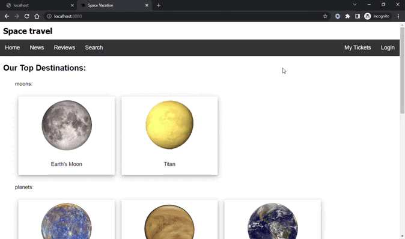

# space-web-app
### Java Spring Boot space travel agency

features:
- basic info about planets
- login page (2 example users)
- search planet by numeric fields
- book tickets to trips
- view or cancel booked tickets
- rate and review trip
- news page
- API to view ticket, destination or trip info

using H2 database (data is loaded on startup, stored in memory and will not persist)

